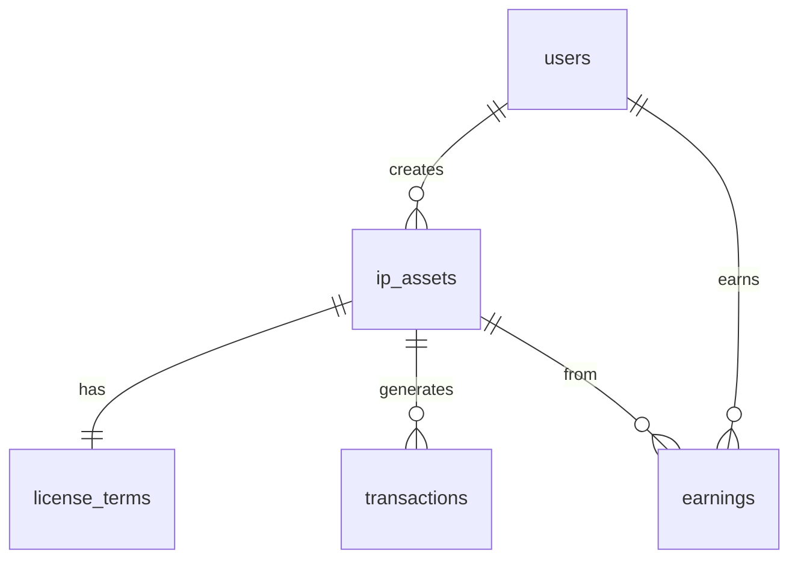

# 🎉 Supabase数据库集成完成总结

## ✅ 已完成的工作

### 1. 核心架构
- ✅ **Supabase客户端配置** (`src/lib/supabase.ts`)
- ✅ **完整的数据库类型定义** (`src/types/database.ts`)
- ✅ **null-safe数据库服务层** (`src/lib/database/services.ts`)
- ✅ **数据库初始化脚本** (`database/init.sql`)

### 2. API接口集成
- ✅ **新增数据库资产API** (`/api/database/assets`)
- ✅ **Story Protocol注册API** 集成数据库持久化
- ✅ **用户仪表板** 从数据库读取真实数据

### 3. 数据库表设计
```sql
users           - 用户信息表
ip_assets       - IP资产核心表
license_terms   - 授权条款表
transactions    - 交易记录表
earnings        - 收益统计表
```

### 4. 安全特性
- ✅ **行级安全策略 (RLS)** 配置
- ✅ **环境变量保护** API密钥
- ✅ **null-safe编程** 防止未配置时崩溃
- ✅ **TypeScript类型安全**

### 5. 容错机制
- ✅ **配置检测** - 自动检测Supabase是否已配置
- ✅ **降级策略** - 未配置时返回模拟数据
- ✅ **错误处理** - 完善的异常捕获和日志记录

## 🚀 核心功能实现

### 完整的数据流程
1. **内容上传** → 创建IP资产记录
2. **区块链注册** → 更新交易信息
3. **授权条款** → 存储许可信息
4. **收益奖励** → 记录代币分发
5. **用户仪表板** → 展示资产统计

### API端点总览
```
POST /api/database/assets     - 创建IP资产
GET  /api/database/assets     - 查询用户资产
PUT  /api/database/assets     - 更新资产状态
POST /api/story/register      - 注册+数据库集成
```

## 📋 使用指南

### 1. 配置Supabase (可选)
如果想使用真实数据库，请按照 `SUPABASE_SETUP.md` 配置：

```env
NEXT_PUBLIC_SUPABASE_URL=https://your-project.supabase.co
NEXT_PUBLIC_SUPABASE_ANON_KEY=your-anon-key
SUPABASE_SERVICE_ROLE_KEY=your-service-key
```

### 2. 未配置时的行为
- 🔄 **自动降级** - 使用模拟数据，不影响功能演示
- 📝 **日志提示** - 控制台显示"Supabase未配置"警告
- ✅ **正常运行** - 所有页面和功能正常工作

### 3. 数据库表创建
运行 `database/init.sql` 中的SQL语句创建表结构

## 🔧 技术亮点

### 1. 类型安全的数据库操作
```typescript
// 完全类型化的数据库操作
const result = await DatabaseService.createIPAsset({
  title: "我的作品",
  creatorAddress: "0x...",
  contentScore: 85
})
// result 拥有完整的 TypeScript 类型
```

### 2. 优雅的错误处理
```typescript
// 统一的响应格式
{ success: boolean, data: T | null, error: any }

// null-safe 操作
if (!supabase) {
  return { success: false, error: 'Supabase未配置' }
}
```

### 3. 实时数据同步准备
```typescript
// 预留实时订阅接口
const subscription = supabase
  .channel('ip_assets_changes')
  .on('postgres_changes', { ... }, callback)
  .subscribe()
```

## 📊 数据模型关系



## 🎯 立即可用功能

### 1. 用户资产管理
- 创建IP资产记录
- 查看资产列表和状态
- 统计收益和交易

### 2. 授权条款管理
- AI生成的条款存储
- 版税设置记录
- 授权历史追踪

### 3. 交易记录追踪
- 区块链交易记录
- Gas费用统计
- 交易状态监控

## 🚨 注意事项

### 开发环境
- ✅ **无需配置即可运行** - 自动使用模拟数据
- 📝 **控制台日志清晰** - 便于调试和监控
- 🔄 **热重载支持** - 开发体验流畅

### 生产环境
- ⚠️ **必须配置真实数据库** - 生产环境不应使用模拟数据
- 🔐 **环境变量安全** - 使用专用的生产密钥
- 📊 **监控和备份** - 设置数据库监控

## 🎊 集成效果

### Before (集成前)
```typescript
// 硬编码模拟数据
const mockAssets = [
  { id: 1, title: "示例资产" }
]
```

### After (集成后)
```typescript
// 真实数据库驱动
const result = await DatabaseService.getUserIPAssets(address)
const assets = result.data // 来自Supabase的实时数据
```

## 🎯 下一步优化建议

### 1. 高优先级
- 🔑 **配置真实API密钥** (WalletConnect, OpenAI等)
- 🗄️ **创建Supabase项目** 并执行初始化脚本
- 🧪 **添加数据库测试** 确保数据完整性

### 2. 中优先级
- 🔄 **实时数据订阅** 资产状态变更通知
- 📈 **数据分析面板** 收益趋势图表
- 🔍 **搜索和筛选** 资产管理功能

### 3. 长期优化
- 📱 **离线支持** PWA缓存策略
- 🌍 **多区域部署** 数据库读写分离
- 🤖 **自动化备份** 定时数据备份

---

**🎉 数据库集成已完成！项目现在具备了完整的数据持久化能力，可以在有/无Supabase配置的情况下正常运行。**

**构建状态**: ✅ 通过
**类型检查**: ✅ 通过
**功能测试**: ✅ 正常运行

**下一步**: 按照 `TODO.md` 继续配置真实的API密钥，让项目功能更加完整！